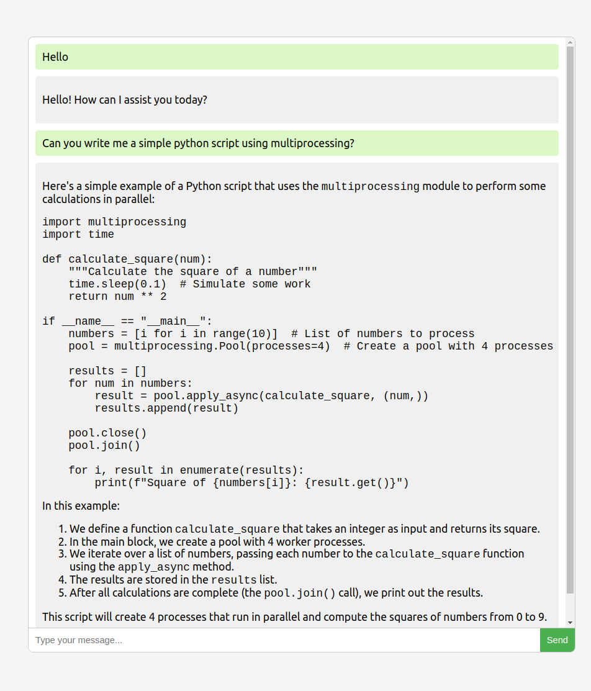

# simple_chatbot

This is a simple chatbot web app based on FastAPI and React, featuring the use of `ollama` to run LLMs.

## Installation

Make sure you have installed [npm](https://docs.npmjs.com/cli/v10/commands/npm-install), [ollama](https://ollama.com/), and [python3](https://www.python.org/downloads/).

### Python dependencies

```bash
pip install -r requirements.txt
```

### React

```bash
cd frontend/ && npm install
```

## Running the chatbot

Make sure ollama server is running in the background (refer to [this doc](https://github.com/ollama/ollama/blob/main/README.md#quickstart))

### Run the FastAPI server

```bash
python3 backend/main.py  # this will run on http://localhost:9091
```

### Run the React web app

```bash
cd frontend/ && npm start  # this will run on http://localhost:3000
```

When you open the react app url in the browser, you will see a view something like this:


